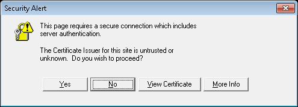
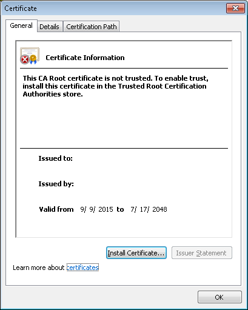
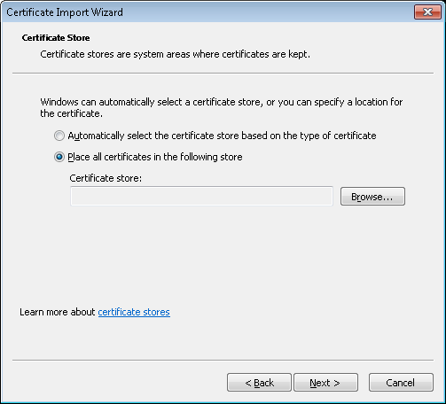
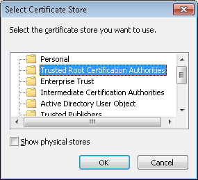

# Using a Self-signed cert

If you're using a self-signed cert for your AGS/Portal servers, you need to make sure that the certificate is installed into your list of trusted sites.  Note that this is *per user*, so you'll need to do this as whichever user your jenkins job runs under.  

Log onto your CI slave as the user that your service runs as; open up a console, and run the publishing task for a single mxd, i.e.:
```
mapservicepublisher --config config.json --inputs Map1.mxd --username <myUsername> --password <myPassword>
```
At the prompt, click `View Certificate`



Select `Install Certificate`



Select `Place all the certificates in the following store`



Select `Trusted Root Certification Authorities` for the store



If you are using federated AGS and Portal servers, you'll recieve multiple prompts, and you will need to install each cert separately. 

