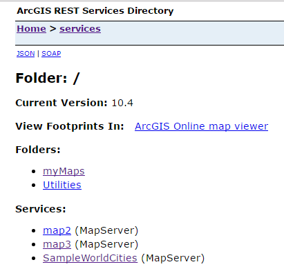
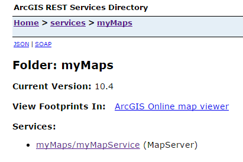

# Basic Example

This is a simple walkthrough for publishing map services using slap; for the purposes of this example, let's assume we have the following setup:

* An ArcGIS for Server instance, `http://myhost.mydomain.com`
* An admin user on the instance, with username `siteadmin`, password `arcgis`
* A directory `C:\maps` on `myhost`, containing three map documents that we want to publish: `map1.mxd`, `map2.mxd`, and `map3.mxd`

## Setting up the Environment
Typically you'll run slap from your ArcGIS server; depending on how your system is set up, there are a couple of tasks that may need to be done first:

* The local Python installation must be in the system `PATH` so that it can be run from a command prompt
* The default Python package manager (pip) must be available; if you're at 10.4 or above, this is already installed

If you're not sure how to set these things up, there are a couple of good tutorials to [walk](https://pythongisandstuff.wordpress.com/2013/07/10/locating-python-adding-to-path-and-accessing-arcpy/) you [through](https://pip.pypa.io/en/stable/installing/#do-i-need-to-install-pip).  Once your Python environment is set up properly, installing slap is easy; just open a command prompt and do:

```shell
pip install slap
```

You should see output similar to:

```shell
Collecting slap
  Downloading https://testpypi.python.org/packages/d7/f0/0c7b09f1478557e06cfb4df161bde790c9974ee56122127389a9704663be/slap-3.0.0.dev5-py2-none-any.whl
Collecting requests (from slap)
  Downloading https://testpypi.python.org/packages/6d/00/8ed1b6ea43b10bfe28d08e6af29fd6aa5d8dab5e45ead9394a6268a2d2ec/requests-2.5.4.1-py2.py3-none-any.whl (468kB)
Installing collected packages: requests, slap
Successfully installed requests-2.5.4.1 slap-3.0.0.dev5
```

## Configuration 
Slap uses a configuration file to determine where and how to publish map services; this configuration file is in standard [json](https://www.copterlabs.com/json-what-it-is-how-it-works-how-to-use-it/) format, and can be generated using slap itself.  To create the bare-bones configuration file that `slap` will use to publish services, open your command prompt and do:

```shell
cd c:\maps
slap init --name myhost.mydomain.com
```

You should see a new file in the directory, named `config.json`, with a list of inputs to publish:

```javascript
{                                                   
    "agsUrl": "https://myhost.mydomain.com:6443/arcgis/admin", 
    "mapServices": {                                
        "services": [                               
            {                                       
                "input": "C:\\maps\\map1.mxd"       
            },                                      
            {                                       
                "input": "C:\\maps\\map2.mxd"       
            },                                      
            {                                       
                "input": "C:\\maps\\map3.mxd"       
            }                                       
        ]                                           
    }                                               
}                                                   
```

### Editing the Config File
You can open the `config.json` file with any text editor, and make changes to the entries; for example, if you want to publish `map1.mxd` to a subfolder called `myMaps` and change the service name to `myMapService`, change the config file to:

```javascript
{                                                   
    "agsUrl": "https://myhost.mydomain.com:6443/arcgis/admin", 
    "mapServices": {                                
        "services": [                               
            {                                       
                "input": "C:\\maps\\map1.mxd",
                "folderName": "myMaps",
                "serviceName": "myMapService"
            },                                      
            {                                       
                "input": "C:\\maps\\map2.mxd"       
            },                                      
            {                                       
                "input": "C:\\maps\\map3.mxd"       
            }                                       
        ]                                           
    }                                               
}                                                   
```

For more configuration examples, see the slap [documentation](https://github.com/gisinc/slap#config-files).

## Publishing Services
Once the config file is set up, you can publish the new services by doing:


```shell
slap publish --username siteadmin --password arcgis
```

And you should see output like the following:

```shell
Publishing all...
Publishing C:\maps\map1.mxd
C:\maps\map1.mxd published successfully
Publishing C:\maps\map2.mxd
C:\maps\map2.mxd published successfully
Publishing C:\maps\map3.mxd
C:\maps\map3.mxd published successfully
```

Now if you navigate to your REST service endpoint, you should see:





Note that slap will automatically overwrite any existing services; if you run the same command again, you can see this from the output:

```shell
Publishing all...
Publishing C:\maps\map1.mxd
Deleting old service...
C:\maps\map1.mxd published successfully
Publishing C:\maps\map2.mxd
Deleting old service...
C:\maps\map2.mxd published successfully
Publishing C:\maps\map3.mxd
Deleting old service...
C:\maps\map3.mxd published successfully
```